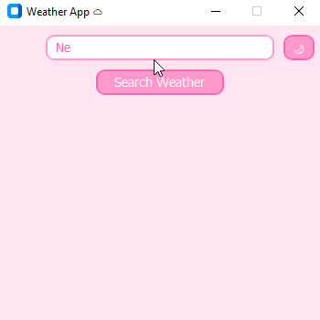

# 🌦️ Weather App

A simple weather application built with Python and Tkinter to display real-time weather data.  
It connects to the [OpenWeatherMap API](https://openweathermap.org/) to show the current temperature and weather description based on the city entered by the user.

---

## 🧰 Technologies Usedp

- [Python 3.10+](https://www.python.org/)
- [CustomTkinter](https://customtkinter.tomschimansky.com/) – GUI
- [Requests](https://pypi.org/project/requests/) – HTTP requests
- [python-dotenv](https://pypi.org/project/python-dotenv/) – Environment variable loader
- [OpenWeatherMap API](https://openweathermap.org/api)

---

## 📷 Screenshot



## 🚀 How to Run the Project

1. Clone the repository:
   ```bash
   git clone https://github.com/your-username/weather-app.git
   cd weather-app

2. Install the dependencies:
    pip install -r requirements.txt

3. Create a .env file with your API key:
    API_KEY=your_api_key_here

4. Run the application:
    python weather_app.py

---

## 💡 Features

- Get current weather by typing a city name
- Display temperature (°C) and weather description 
- Multi-day forecast (3 days)
- History of searched cities
- Lightweight desktop GUI using Tkinter
- API key protection via .env file

---

## ✨ Possible Improvements

- Improve layout with grid() or ttk
- Web version with Streamlit

---

## 📁 Project Structure

```bash
weather-app/
├── themes/
│   └── pink-theme.json
│   └── dark-theme.json
├── midias/
│   └── preview.gif
├── .env
├── weather_app.py
├── README.md
└── requirements.txt

---

## 📄 License

This project is licensed under the MIT License.

